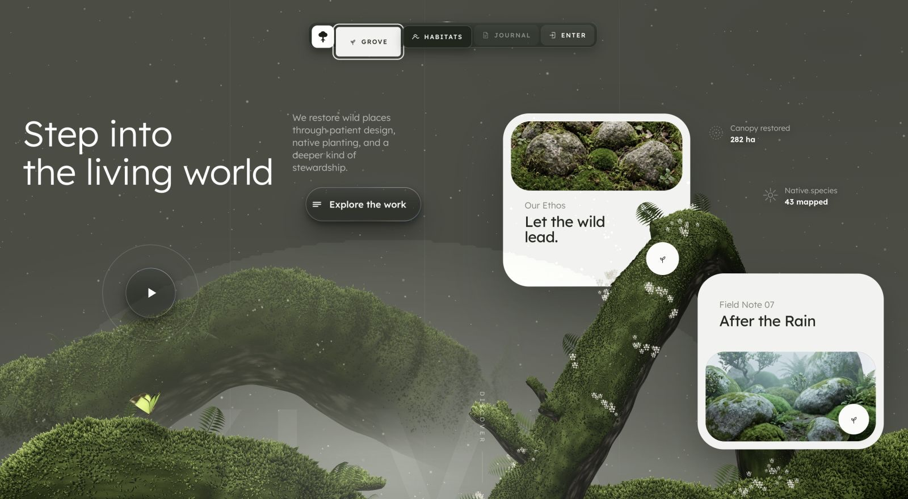

# Sylva

Sylva is an interactive Three.js landscape study: a procedural, moss-covered root grows through an editorial conservation hero and reacts to the pointer as if it were alive.

[**View the live experience**](https://mengto.github.io/sylva/)



## What is inside

- A deterministic root and arch assembled from swept tube geometry, recursive offshoots, ferns, flowers, particles, and up to 250,000 instanced moss blades on desktop.
- Pointer-responsive moss that parts around the cursor and releases a short pollen trail as the pointer moves across the landscape.
- A spring-driven navigation dock with proximity magnification, moving specular rims, keyboard focus states, and small particle bursts when its sections change.
- Two sandboxed WebGL2 button studies with animated liquid-metal surfaces for the Explore and Play controls.
- Staged type, card, image, and procedural-scene entrances, including canvas-sampled pixel reveals over the two field-note photographs.
- A responsive single-column composition for narrow screens and a reduced-motion path for visitors who request it.

## How it is made

The complete page lives in [`index.html`](index.html). It uses a vendored Three.js r149 build to create the root, moss, undergrowth, flowers, moths, pointer spray, light, and camera movement at runtime. The same seeded noise grows the same landscape on every load; no model file or pre-rendered moss plate is downloaded.

The interface is plain HTML and CSS around that scene. Pointer parallax, the navigation dock, the card reveals, and the WebGL renderer share one animation loop. The two liquid-metal controls remain isolated in sandboxed iframes so each control can own its WebGL2 state without leaking into the page.

Everything required at runtime is included in this repository. The page makes no external network request after it loads.

## Run locally

Serve the repository root over HTTP:

```bash
python3 -m http.server 4173 --bind 127.0.0.1
```

Then visit [http://127.0.0.1:4173/](http://127.0.0.1:4173/).

There is no install or build step. A browser with WebGL2 support is recommended; the page retains its layout and core content if the main Three.js scene cannot start.

## Project structure

```text
sylva/
├── index.html                  # Complete experience
├── inner-green-assets/
│   ├── three.min.js             # Vendored Three.js r149 runtime
│   ├── lexend-latin.woff2       # Local Lexend variable font
│   ├── liquid-metal-explore.html
│   ├── liquid-metal-play.html
│   └── card-*.jpg                # Field-note imagery
├── assets/                     # README preview
├── licenses/                   # Third-party license texts
└── README.md
```

## Design and attribution

This is an independent implementation study of the "Find your inner green" composition from Daily Hero 20 by [Daniel Snows](https://www.instagram.com/danielsnows/). The page recreates the reference's broad editorial composition while replacing its foreground artwork with original procedural geometry, shaders, motion, and interactions. It is not affiliated with or endorsed by the original designer.

The local project notes record Higgsfield image generation and compositing for the supporting imagery. Three.js r149 is distributed under the MIT License, and Lexend is distributed under the SIL Open Font License 1.1; their license texts are included in [`licenses/`](licenses/).

No license is granted for reuse or redistribution of the Sylva code, design, or artwork. The bundled third-party components remain under their respective licenses.
