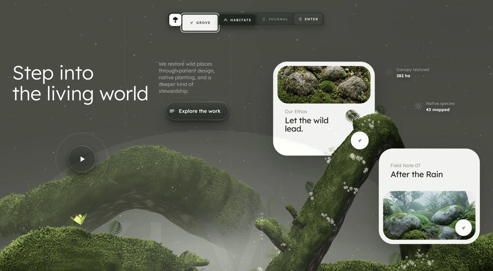

# 실바 (Sylva) — 살아 있는 세계로

[](https://sigco3111.github.io/sylva/)
[](#프로젝트-구조)
[](https://threejs.org)
[](#실행-방법)
[](https://github.com/MengTo/sylva)

> **인터랙티브 Three.js 풍경 연구 — 살아 숨 쉬듯 자라는 이끼 세계로 들어가는 경험을 한국어로 즐기세요.**
>
> 🟢 [sigco3111/sylva](https://github.com/sigco3111/sylva)는 [`MengTo/sylva`](https://github.com/MengTo/sylva)의 한글화 미러입니다. 원본의 모든 인터랙션·시각 효과는 그대로 보존되었으며, 화면에 보이는 텍스트만 한국어로 바뀝니다.

[**▶ 라이브 페이지 열기**](https://sigco3111.github.io/sylva/)

---

## 목차

1. [이 프로젝트가 무엇인가](#이-프로젝트가-무엇인가)
2. [라이브 화면 미리보기](#라이브-화면-미리보기)
3. [주요 인터랙션 살펴보기](#주요-인터랙션-살펴보기)
4. [어떻게 만들어졌는가](#어떻게-만들어졌는가)
5. [프로젝트 구조](#프로젝트-구조)
6. [실행 방법](#실행-방법)
7. [기술적 선택의 기록](#기술적-선택의-기록)
8. [원작과의 관계 및 크레딧](#원작과의-관계-및-크레딧)
9. [라이선스](#라이선스)

---

## 이 프로젝트가 무엇인가

**실바(Sylva)** 는 인터랙티브한 풍경 편집 디자인의 한 형태를 코드로 구현한 단일 페이지 웹 작품입니다. 화면 위에서 이끼가 쥐를 피해 양탄트럭처럼 갈라지고, 이동하면 꽃가루 같은 짧은 궤적이 떨어지며, 액체 금속 표면을 입은 두 개의 컨트롤이 호버에 반응합니다. 장면은 미리 만들어진 이미지가 아니라 **Three.js로 매 순간 묘사되는 절차적 지오메트리**이므로 같은 시드 노이즈가 매 로드마다 동일한 풍경을 자라게 합니다.

### 한 줄 요약

> "인내로운 디자인, 자생 식물, 더 깊은 종류의 관리로 야생의 장소를 복원합니다." — 메인 헤드라인 아래에 흐르는 메시지

### 누구를 위한 작품인가

- **인터랙티브 디자인을 공부하는 사람** — `index.html` 한 파일 안에 CSS 변수 시스템, 포인터 패럴럭스, WebGL2 액체 금속 셰이더, 절차적 식물 모델링이 어떻게 공존하는지 살펴볼 수 있습니다.
- **풍경 사진·도시 복원 콘텐츠의 영감을 찾는 사람** — 디자인 시안 없이도 동작하는 단일 HTML 제작 사례가 됩니다.
- **Three.js r149 정도의 베이스 API를 다뤄본 적이 있는 사람** — 인스턴싱(instsancing)된 13만 개 이끼 잎의 렌더링이 어떤 식으로 분리되어 들어가는지 (`g.setAttribute('position'...)`) 따라 읽기 좋습니다.

---

## 라이브 화면 미리보기



> 위 이미지는 README용 정적 썸네일입니다. **실제 인터랙션**(포인터 반응, 카드 진입 애니메이션, 영상 재생 액체 금속 버튼)은 [라이브 페이지](https://sigco3111.github.io/sylva/)에서 직접 확인하세요.

---

## 주요 인터랙션 살펴보기

| 인터랙션 | 어디서 일어나는가 | 어떻게 반응하는가 |
|---------|-----------------|----------------|
| **포인터 패럴럭스** | `.dock`, `.headline`, `.lede`, `.pill`, `.play-wrap`, 두 카드, `.scroll` 9개 레이어 | 마우스/트랙패드 위치를 부드럽게 따라가며 회전·이동. `--pd`로 레이어별 깊이, `--pr`로 회전 강도 조정 |
| **이끼 갈라짐 + 꽃가루** | 화면 위 `#scene` 캔버스 | 마우스가 지나간 자리의 이끼가 양탄트럭처럼 벌어지고, 잠깐의 꽃가루 흔적이 새겨집니다 |
| **Dock 확대 + 반사 림** | 상단 둥근 도크 | 가까이 갈수록 알약이 살짝 부풀고, 시선 방향을 따라가는 conic gradient 반사 윤곽이 돋보입니다 |
| **러프 매그니피케이션** | 도크 위 키보드 포커스 | 포커스 시 패럴럭스가 멈추고 셀이 부풀어 떠오릅니다 |
| **WebGL2 액체 금속 버튼** | "작품 탐험하기" / "영상 재생" 두 개의 iframe | 두 개의 자체 완결 WebGL2 문서. iframe에 샌드박스를 걸어 페이지와 GL state를 분리합니다 |
| **카드 진입 — 픽셀 출현** | 두 카드(이끼 쿠션 · 비 그친 뒤) | 12스텝 애니메이션으로 사진이 한 번에 걸쳐 들어오면서 흰빛 가우시안 픽셀 줄이 가장자리를 따라 흐릅니다 |
| **스크롤 큐** | 우측 세로 트랙 | 위에서 아래로 천천히 떨어지는 점이 들어가 있어 "더 알아보기"를 가리킵니다 |

| 액션 | 단축키 / 방법 | 효과 |
|-----|-------------|-----|
| 키보드 탭 | `Tab` | 도크·노브·버튼이 차례로 포커스됩니다 (보인 링은 카드 위 버튼이라 어두운 색) |
| `prefers-reduced-motion` | OS 설정 | 모션이 꺼지면 일부 효과가 즉시 종료 상태로 들어가고 패럴럭스도 멈춥니다 |

---

## 어떻게 만들어졌는가

이 페이지의 모든 것은 **`index.html` 한 파일에 들어 있습니다**. 빌드 단계가 없습니다.

### 핵심 스택

- **HTML + CSS** — 페이지의 모든 정적·동적 시각을 담당합니다. 디자인 단위(`--u`)는 뷰포트 폭 1600px을 기준으로 픽셀 환산되어 모든 좌표/패딩이 따라옵니다.
- **Three.js r149 (`sylva-assets/three.min.js`)** — 이끼 뿌리, 양탄트럭으로 쥐를 피해 갈라지는 면, 나비, 꽃가루 가루, 조명, 카메라 움직임을 모두 절차적으로 만듭니다. 시드 노이즈가 동일하기에 매 로드마다 같은 풍경이 자라납니다.
- **두 개의 iframe 안 WebGL2 셰이더** — "작품 탐험하기"와 "영상 재생"은 각각 자체 완결된 WebGL2 문서입니다. `sandbox="allow-scripts"`만 부여해 페이지의 GL state와 격리되어 있고, 각자 다섯 개의 셰이더 패스와 빛 분산 모델을 가지고 있습니다.
- **Lexend Latin (`sylva-assets/lexend-latin.woff2`)** — 같은 페이지에서 모든 텍스트를 동일한 가변 폰트로 렌더링합니다.

### 페이지의 한 살

1. 페이지가 로드되면 `.js` 클래스가 `<html>`에 박히고, 모든 등장 요소는 1~1.5초 동안 clip-path 또는 opacity로 등장합니다.
2. 도크 캡슐이 페이드인되고, 알약들이 위에서 아래로 짧게 떨어지는 듯 들어옵니다.
3. 카드 `Ethos`와 `Field Note`는 `--d` 변수로 개별 딜레이(0.92초, 1.08초)를 두고 픽셀 단위 출현 애니메이션을 시작합니다.
4. 메인 헤드라인 두 줄은 각자 다른 딜레이로 풀로 떠오릅니다.
5. Three.js가 초기 프레임 한두 개를 백그라운드에서 그린 다음 canvas가 부드럽게 페이드인됩니다.
6. 포인터가 화면 어디로 움직이든 단일 rAF 루프가 9개 레이어의 패럴럭스, 액체 금속 프레임, WebGL2 셰이더를 한 번에 그립니다.

> **빌드 없음, 의존성 없음.** 모든 자원이 저장소 안에 들어 있고 네트워크 요청은 페이지 로드 후로 발생하지 않습니다. `file://`에서도 잘 동작합니다.

---

## 프로젝트 구조

```text
sylva/
├── index.html                          # 전체 경험 (HTML + CSS + Three.js + 페이지 JS)
├── sylva-assets/
│   ├── three.min.js                    # vendored Three.js r149 런타임 (≈594KB)
│   ├── lexend-latin.woff2              # 로컬 Lexend 가변 폰트
│   ├── liquid-metal-explore.html       # 액체 금속 "작품 탐험하기" iframe (WebGL2)
│   ├── liquid-metal-play.html          # 액체 금속 "영상 재생" iframe (WebGL2)
│   ├── card-ethos.webp                 # 카드 1(이끼 쿠션) 사진
│   └── card-ecostove.webp              # 카드 2(비 그친 뒤) 사진
├── assets/                             # README 미리보기 이미지
├── licenses/                           # 서드파티 라이선스 전문
│   ├── THREE-LICENSE.txt               # MIT
│   └── LEXEND-OFL.txt                  # SIL Open Font License 1.1
└── README.md                           # 지금 보고 있는 문서
```

---

## 실행 방법

빌드 도구가 없으므로 **단순한 HTTP 서버**만 있으면 됩니다. 의존성 설치는 필요하지 않습니다.

```bash
# 저장소 클론 후
git clone https://github.com/sigco3111/sylva.git
cd sylva

# 어떤 HTTP 서버든 상관 없습니다
python3 -m http.server 4173 --bind 127.0.0.1
# 또는 Node 사용 시
# npx serve -p 4173
```

이제 <http://127.0.0.1:4173/>을 브라우저로 열어 보세요. WebGL2를 지원하는 모던 브라우저(Chrome / Firefox / Safari 15+)와 그에 맞는 GPU가 권장됩니다. WebGL2가 없거나 Three.js 초기화가 실패해도 본문 텍스트와 카드 정적 레이아웃은 보입니다.

---

## 기술적 선택의 기록

이 절은 단순한 사용설명서가 아니라, **왜 이렇게 만들었는가** 를 짧게 풀어놓은 메모입니다. 원본 작성자가 README와 코드 안에 남겨둔 주석에서 발췌·정리했습니다.

### 1. 절차적 이끼 vs. 미리 만들어진 PNG

> 옛 빌드는 4.6MB 짜리 투명 PNG 두 장(`moss-arch.png`, `moss-ridge.png`)을 다운로드해 알파 합성으로 뿌리를 그렸다. 이 빌드는 **중심선에 따라 만든 원뿔형 튜브**와 **그 위로 덮는 두 번째 튜브 아치**, **재귀적 잔가지**, **빛을 받는 면에만 13만 개 인스턴싱된 이끼 잎**으로 대체됐다. 절차적이라는 건 곧 텍스처 업로드가 필요 없다는 뜻이고, 그건 곧 `file://`에서도 잘 동작한다는 뜻이다.

### 2. 백드롭 블러를 일부러 안 쓰는 도크

> 캔버스가 매 프레임 다시 그려지는 위에 도크가 떠 있다. backdrop-filter를 쓰면 캔버일을 매 프레임 다시 샘플링·블러해야 해서 페이지 전체가 약 20fps로 떨어진다. 반지름은 효과가 없었지, 비용은 추가 패스에서 나왔다. 그래서 같은 크기에서 **반투명 패널 + 위쪽 가장자리에 살짝 들어오는 빛** 으로 같은 인상을 읽게 했다.

### 3. iframe으로 캡슐화하는 액체 금속 컨트롤

> 두 액체 금속 컨트롤은 페이지의 메인 GL state를 망치고 싶지 않아서 자체 WebGL2 문서로 떼어내고 iframe으로 마운트했다. 그러면 두 컨트롤의 다섯 프로그램, 패스 순서, 인터랙션 모델이 페이지에 영향을 주지 않는다. iframe의 `sandbox="allow-scripts"` (origin 없음)는 같은 효과를 더 많이 가져다준다 — Chrome이 오프프로세스로 그리고 페이지가 도크 위로 pointermove를 받을 수 있게 된다.

### 4. 카드 모서리 안 풀리는 이유

> .card에 z-index를 일부러 안 두는 이유는 #scene(묘사된 모래)이 카드 어깨 위로 흘러내려야 하기 때문이다. z-index 기본값이면 카드는 자체 stacking context를 만들지 않아서 몸이 #scene 아래에 페인트되고, .knob는 z 4라서 여전히 이끼 앞에 그려진다.

### 5. 픽셀 출현 애니메이션의 정직함

> 카드 그림이 들어올 때 가장자리에 따라 흐르는 흰 가우시안 픽셀 줄, .portal-media CSS clip, 그리고 캔버스가 그리는 픽셀 점 — 셋이 한 곳에 모여야 한다. 그래서 ease 곡선이 아니라 `floor(t * 12) / 12` (선형 12스텝) 으로 CSS를 그대로 재현한다. ease로 가면 점 무리의 무게중심이 가장자리보다 1/3 앞쪽으로 어긋난다.

### 6. reduce-motion 존중

> OS에서 모션을 꺼두면 도크, 카드, 헤드라인, 출현, 패럴럭스가 모두 즉시 종료 상태로 들어간다. 도크의 알약, 캔버스 fade도 같은 방식으로 잠근다. 그래서 사용자 입장에서는 정보와 정적 레이아웃은 그대로 받으면서도 모션 부작용은 겪지 않는다.

---

## 원작과의 관계 및 크레딧

### 원작

- **저장소**: [`MengTo/sylva`](https://github.com/MengTo/sylva) (MIT 라이선스로 코드 자체의 재사용은 허용되지 않음 — 원작자 표기 노트에 명시). 이 한글화 미러는 그저 화면에 보이는 텍스트만 한국어로 바꾼 보존용 포크입니다.
- **라이브 페이지**: <https://mengto.github.io/sylva/>

### 디자인 영감

이 페이지의 레이아웃은 편집 디자인가 [Daniel Snows](https://www.instagram.com/danielsnows/)의 보호 디자인 구성을 독립적으로 연구한 결과입니다. 실바는 광범위한 구성 아이디어는 보존하면서 전경 일러스트를 절차적 지오메트리·셰이더·모션·인터랙션으로 전부 대체했습니다. 원작 디자이너와 제휴 또는 보증 관계는 없습니다.

### 작성자 노트

보조 이미지의 일부 생성·합성에는 Higgsfield 이미지 생성이 사용되었습니다. 이에 대한 메모는 원본 저장소의 프로젝트 노트에 남아 있습니다.

### 함께 만들어진 다른 페이지

원작자가 같은 톤으로 만든 다른 인터랙티브 작품들:

- **[The Complete Shelf](https://github.com/MengTo/complete-shelf)** — 일곱 권의 천장 장정 양장본을 모은 인터랙티브 Three.js 라이브러리. [라이브](https://mengto.github.io/complete-shelf/)
- **[Towers](https://github.com/MengTo/towers)** — 4.5초 동안 바닥부터 자라나는 탑. [라이브](https://mengto.github.io/towers/)
- **[Kage](https://github.com/MengTo/kage)** — 교토 산속 사찰 다섯 챕터의 야간 산책을 Three.js로 그린 인터랙티브. [라이브](https://mengto.github.io/kage/)
- **[Sketchbook](https://github.com/MengTo/sketchbook)** — 싱가포르 스케치북을 한 정적 HTML로 만든 페이지 넘김. [라이브](https://mengto.com)

---

## 라이선스

- **이 미저장소의 코드/디자인/그림 자체는 원본에 따라 사용·재배포를 허가하지 않습니다.** 원본 README 끝의 안내와 동일합니다.
- **번들된 서드파티**는 각자의 라이선스를 그대로 따릅니다 — `licenses/THREE-LICENSE.txt` (Three.js r149, MIT)와 `licenses/LEXEND-OFL.txt` (Lexend, SIL OFL 1.1)이 저장소 안에 들어 있습니다.
- **이 한글화 미러의 추가 작업**(한글 매핑, 한국어 UI 사본, 번역 README)은 [sigco3111](https://github.com/sigco3111)에게 있습니다. 원본 코드의 사용 조건은 동일합니다.

— *“야생이 이끄도록. 살아 있는 세계로 발을 들여놓다.”*
